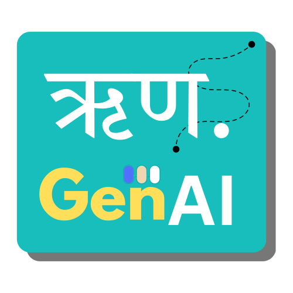

<div align="center">
  
</div>

# 🚀 RunaGen AI Career Companion
## Google Cloud Gen AI Exchange Hackathon 2025

> **A comprehensive career development platform powered by Google Cloud's Gemini AI, featuring intelligent resume analysis, personalized learning roadmaps, and interactive career simulations.**

### Live Demo
[RunaGen AI Prototype — Live Link](https://classy-llama-a6740f.netlify.app/)

[RunaGen AI Prototype — Demo Video Link](https://drive.google.com/file/d/1zAdDNFjA5LxxSZDx6IDi_qfXwdP3NT18/view)

[RunaGen AI Prototype — Presentation Deck]( https://storage.googleapis.com/vision-hack2skill-production/innovator/USER00748815/1758477799496-GenAIExchangeHackathonPrototypeSubmission11.pdf)


Note: The backend currently runs on `http://localhost:3001`. To fully test the prototype, open the project in VS Code and run the backend locally as described in the Quick Start section.

    

---

## 🎯 **Project Overview**

AI Career Companion is an innovative career development platform that leverages Google Cloud's Gemini AI to provide personalized career guidance, skill gap analysis, and interactive learning experiences. The platform helps users identify career opportunities, create personalized learning roadmaps, and practice real-world scenarios through AI-powered simulations.

### **🏆 Hackathon Focus**
This project demonstrates the power of Google Cloud's Generative AI services, specifically:
- **Gemini 2.5 Flash** for intelligent content generation
- **Vertex AI** for advanced AI capabilities
- **RAG (Retrieval-Augmented Generation)** for context-aware responses
- **Vector Search** for semantic understanding

---

## 🛠️ **Tech Stack**

### **Frontend**
- **React 18** with TypeScript
- **Vite** for fast development and building
- **Tailwind CSS** for modern, responsive UI
- **Lucide React** for beautiful icons
- **Three.js** for 3D visualizations

### **Backend**
- **Node.js** with Express.js
- **ES Modules** for modern JavaScript
- **MongoDB** with Mongoose ODM
- **Multer** for file uploads
- **PDF-Parse** for document processing

### **AI & Cloud Services**
- **Google Cloud Vertex AI** (Gemini 2.5 Flash)
- **YouTube Data API v3** for video recommendations
- **Text Embeddings** for semantic search
- **Vector Store** for RAG implementation

### **Development Tools**
- **ESLint** for code quality
- **PostCSS** with Autoprefixer
- **TypeScript** for type safety

---

## ✨ **Key Features**

### **🎯 Working Features**

#### **1. AI-Powered Resume Analysis**
- ✅ **PDF/Word/PowerPoint/Image parsing** with intelligent text extraction
- ✅ **Gemini-powered skill extraction** using RAG
- ✅ **Job role auto-detection** with confidence scoring
- ✅ **Skills gap analysis** with priority-based recommendations
- ✅ **Job matching** with compatibility scores

#### **2. Personalized Learning Roadmaps**
- ✅ **3-stage skill gap analysis** (Critical, Important, Nice-to-have)
- ✅ **YouTube video integration** with real-time search
- ✅ **Exam preparation** with certification recommendations
- ✅ **Practice projects** with skill development tracking
- ✅ **Learning platform suggestions** (Coursera, Udemy, etc.)

#### **3. AI Career Mentor**
- ✅ **Conversational AI mentor** powered by Gemini
- ✅ **Context-aware responses** using RAG
- ✅ **Resume analysis integration** for personalized advice
- ✅ **Conversation history** with MongoDB persistence
- ✅ **Badge system** for engagement tracking

#### **4. Career Simulations**
- ✅ **Interactive scenarios** for different career paths
- ✅ **Skill-based challenges** with real-time feedback
- ✅ **Progress tracking** and completion metrics
- ✅ **Simulation templates** for various roles

#### **5. Data Persistence**
- ✅ **MongoDB integration** for all user data
- ✅ **File storage** with automatic cleanup
- ✅ **User session management**
- ✅ **Conversation history** with search capabilities

### **⚠️ Features with Limitations**

#### **1. YouTube Integration**
- ⚠️ **Mock data fallback** when API key not configured
- ⚠️ **Rate limiting** on YouTube API calls
- ✅ **Real video links** when API key is provided

#### **2. AI Services**
- ⚠️ **Fallback mechanisms** when Gemini API is unavailable
- ⚠️ **Error handling** with graceful degradation
- ✅ **Multiple AI service layers** for reliability

#### **3. File Processing**
- ⚠️ **Limited image processing** capabilities
- ⚠️ **Complex document parsing** may need refinement
- ✅ **PDF and text processing** working well

---

## 🚀 **Quick Start**

### **Prerequisites**
- Node.js 18+
- MongoDB Atlas account
- Google Cloud Platform account
- YouTube Data API key (optional)

### **Installation**

1. **Clone the repository**
   ```bash
   git clone <repository-url>
   cd ai-career-companion
   ```

2. **Install frontend dependencies**
   ```bash
   npm install
   ```

3. **Install backend dependencies**
   ```bash
   cd project/server
   npm install
   cd ../..
   ```

4. **Set up Google Cloud credentials**
   ```bash
   # 1. Create a Google Cloud project and enable Vertex AI API
   # 2. Create a service account with Vertex AI permissions
   # 3. Download the service account key JSON file
   # 4. Place it in the project/server directory
   ```

5. **Configure environment variables**
   ```bash
   # Create .env file in server directory
   cp project/server/.env.example project/server/.env
   
   # Edit .env file and add your credentials:
   # GOOGLE_APPLICATION_CREDENTIALS=./your-service-account-key.json
   # MONGODB_URI=your_mongodb_connection_string
   # YOUTUBE_API_KEY=your_youtube_api_key (optional)
   ```

6. **Start the application**
   ```bash
   # Terminal 1: Start backend
   cd project/server
   npm start
   
   # Terminal 2: Start frontend
   cd project
   npm run dev
   ```

6. **Access the application**
   - Frontend: http://localhost:5173
   - Backend API: http://localhost:3001

---

## 🔧 **API Endpoints**

### **Resume Analysis**
- `POST /upload_resume` - Upload and analyze resume
- `POST /auto-detect-role` - Auto-detect job role from resume
- `GET /analysis/:id` - Get analysis by ID

### **Learning Roadmaps**
- `POST /generate-learning-roadmap` - Generate AI-powered roadmap
- `POST /generate-skill-roadmap` - Generate skill-specific roadmap
- `GET /roadmap/:id` - Get roadmap by ID
- `GET /user/:userId/roadmaps` - Get user's roadmaps

### **Career Simulations**
- `POST /start-career-simulation` - Start new simulation
- `POST /generate-simulations` - Generate multiple simulations
- `GET /simulation/:id` - Get simulation by ID
- `PUT /simulation/:id/progress` - Update simulation progress

### **AI Mentor**
- `POST /mentor` - Chat with AI mentor
- `GET /conversations/:userId` - Get conversation history
- `GET /user/:userId/history` - Get user interaction history

### **YouTube Integration**
- `GET /test-youtube/:query` - Test YouTube video search

---

## 🗄️ **Database Schema**

### **Analysis Model**
```javascript
{
  userId: String,
  targetRole: String,
  matchScore: Number,
  skillsPresent: [String],
  skillsMissing: [String],
  recommendations: [String],
  createdAt: Date
}
```

### **Roadmap Model**
```javascript
{
  userId: String,
  role: String,
  roadmap: {
    stage_1_critical_gaps: [SkillGap],
    stage_2_important_gaps: [SkillGap],
    stage_3_nice_to_have: [SkillGap],
    learning_resources: Object,
    success_metrics: [String]
  },
  createdAt: Date
}
```

### **Simulation Model**
```javascript
{
  userId: String,
  title: String,
  description: String,
  scenarios: [Object],
  progress: Number,
  completed: Boolean,
  createdAt: Date
}
```

---

## 🎨 **UI/UX Features**

### **Modern Dashboard**
- **Responsive design** with Tailwind CSS
- **Interactive components** with smooth animations
- **Progress tracking** with visual indicators
- **Badge system** for gamification

### **Learning Experience**
- **Modal-based learning** with video integration
- **Tabbed interfaces** for organized content
- **Progress bars** and completion tracking
- **Interactive skill assessments**

### **AI Chat Interface**
- **Real-time messaging** with typing indicators
- **Message history** with search functionality
- **Context-aware responses** from AI mentor
- **Badge notifications** for achievements

---

## 🔍 **AI Implementation Details**

### **RAG (Retrieval-Augmented Generation)**
- **Vector embeddings** for semantic search
- **Context retrieval** from job descriptions
- **Enhanced responses** with relevant information
- **Fallback mechanisms** for reliability

### **Gemini Integration**
- **Gemini 2.5 Flash** for fast responses
- **Structured prompts** for consistent output
- **Error handling** with graceful degradation
- **Multiple service layers** for redundancy

### **Vector Search**
- **Text embeddings** using Google Cloud
- **Semantic similarity** for job matching
- **Context-aware recommendations**
- **Performance optimization**

---

## 🧪 **Testing & Quality**

### **Error Handling**
- **Comprehensive try-catch blocks** throughout the application
- **Graceful degradation** when services are unavailable
- **User-friendly error messages** with actionable guidance
- **Logging system** for debugging and monitoring

### **Performance**
- **Lazy loading** for large datasets
- **Efficient database queries** with proper indexing
- **Caching mechanisms** for frequently accessed data
- **Optimized file processing** with streaming

---

## 🚧 **Known Limitations**

### **Current Issues**
1. **YouTube API Rate Limiting** - May hit limits with high usage
2. **File Processing** - Complex documents may need refinement
3. **AI Response Consistency** - Occasional formatting variations
4. **Mobile Responsiveness** - Some components need mobile optimization

### **Future Improvements**
1. **Real-time Collaboration** - Multi-user features
2. **Advanced Analytics** - Detailed progress tracking
3. **Integration APIs** - LinkedIn, GitHub, etc.
4. **Mobile App** - Native mobile application

---

## 🤝 **Contributing**

### **Development Setup**
1. Fork the repository
2. Create a feature branch
3. Make your changes
4. Test thoroughly
5. Submit a pull request

### **Code Standards**
- **ESLint** configuration for code quality
- **TypeScript** for type safety
- **Conventional commits** for clear history
- **Comprehensive error handling**

---

## 📄 **License**

This project is developed for the Google Cloud Gen AI Exchange Hackathon 2024. All rights reserved.

---

## 🏆 **Hackathon Submission**

### **Innovation Highlights**
- **Advanced RAG Implementation** with vector search
- **Multi-modal AI Integration** (text, documents, videos)
- **Comprehensive Career Development** platform
- **Real-world Application** with practical use cases

### **Technical Achievements**
- **Scalable Architecture** with microservices approach
- **Robust Error Handling** with fallback mechanisms
- **Modern Tech Stack** with best practices
- **Performance Optimization** for production readiness

### **Demo Instructions**
1. Upload a resume to see AI analysis
2. Generate a personalized learning roadmap
3. Chat with the AI mentor for career advice
4. Try career simulations for skill practice
5. Explore the badge system and progress tracking

---

## 📞 **Support**

For questions or issues:
- **GitHub Issues** - Report bugs and feature requests
- **Documentation** - Comprehensive API and setup guides
- **Demo Video** - Watch the application in action

---
---

**Built with ❤️ for Google Cloud Gen AI Exchange Hackathon 2025**